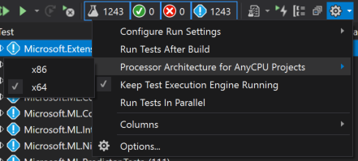

Building ML.NET on Windows
==========================

You can build ML.NET either via the command line or by using Visual Studio.

## Required Software

1. **[Visual Studio 2019 Version 16.4+](https://www.visualstudio.com/downloads/) (Community, Professional, Enterprise)** The Community version is completely free. The below build instructions were verified for VS 16.4.
2. **[CMake](https://cmake.org/)** must be installed from [the CMake download page](https://cmake.org/download/#latest) and added to your path. If you want to use Visual Studio 2022, you need to be using at least CMake 3.21.

### Visual Studio 2019 Installation
We have successfully verified the below build instructions for Visual Studio version 16.4 and higher.

#### Visual Studio 2019 - 'Workloads' based install

The following are the minimum requirements:
  * .NET desktop development
    * All Required Components
    * .NET Framework 4-4.6 Development Tools
  * Desktop development with C++
    * All Required Components
    * MSVC v142 - VS 2019 C++ x64/x86 build tools
    * Windows 10 SDK
  * .NET Core cross-platform development
    * All Required Components

#### Visual Studio 2019 - 'Individual components' based install

The following are the minimum requirements:
  * C# and Visual Basic Roslyn Compilers
  * .NET Core 3.1 SDK
  * Static Analysis Tools
  * .NET Portable Library Targeting Pack
  * Visual Studio C++ Core Features
  * MSVC v142 - VS 2019 C++ x64/x86 build tools
  * MSBuild
  * .NET Framework 4.6 Targeting Pack
  * Windows Universal CRT SDK

#### Visual Studio 2019 - Cross compilation for ARM

If you want to cross compile for arm you will also need from the 'Individual components' section:
  * MSVC v142 - VS 2019 C++ ARM build tools
  * MSVC v142 - VS 2019 C++ ARM64 build tools

## Building Instructions

In order to fetch dependencies which come through Git submodules the following command needs to be run before building: `git submodule update --init`.

### Building From Visual Studio 2019

First, set up the required tools, from a (non-admin) Command Prompt window:

- `build.cmd` - sets up tools and builds the assemblies

After successfully running the command, the project can be built directly from the Visual Studio IDE. Tests can be executed from the VS Test Explorer or command line.

### Building From the Command Line

You can use the Developer Command Prompt, Powershell or work in any regular cmd. The Developer Command Prompt will have a name like "Developer Command Prompt for VS 2019" or similar in your start menu.

From a (non-admin) Command Prompt window:

- `build.cmd` - builds the assemblies
- `build.cmd -test -integrationTest` - builds the assemblies and runs all tests, including integration tests.
- `build.cmd -pack` builds the assemblies and generates the corresponding NuGet packages with the assemblies in `artifacts\packages`"

**Note**: Before working on individual projects or test projects you **must** run `build.cmd` from the root once before beginning that work. It is also a good idea to run `build.cmd` whenever you pull a large set of unknown changes into your branch.

### Cross compiling for ARM

You can use the Developer Command Prompt, Powershell or work in any regular cmd. The Developer Command Prompt will have a name like "Developer Command Prompt for VS 2019" or similar in your start menu.

From a (non-admin) Command Prompt window based on what you want to target:

- `build.cmd /p:TargetArchitecture=arm`
- `build.cmd /p:TargetArchitecture=arm64`

You can then pack them into nugets, pick the same target architecture you built with:

- `build.cmd /p:TargetArchitecture=arm -pack`
- `build.cmd /p:TargetArchitecture=arm64 -pack`

## Running Tests

### Running tests from Visual Studio

After successfully building, run tests through the Visual Studio Test Explorer window.

Before running tests on Visual Studio, make sure you have selected the correct processor architecture (`x64`, `x86`) for running unit tests that your machine supports and that you have built ML.NET on. To check, click on the settings image in the Test Explorer window, then on "Process Architecture for AnyCPU Projects", and then on the correct architecture type, as demonstrated in the image below:

### Running tests from the command line

From root, run `build.cmd -test -integrationTest`.
For more details, or to test an individual project, you can navigate to the test project directory and then use `dotnet test`.

## Running Benchmarks

For more information on running ML.NET benchmarks, please visit the [benchmarking instructions](../../test/Microsoft.ML.PerformanceTests/README.md).

## Known Issues

CMake 3.14 or higher is required for Visual Studio 2019.

You need to run `build` from the root of the repo first prior to opening the solution file and building in Visual Studio.
