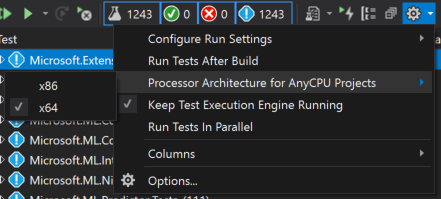

# Building ML.NET on Windows

You can build ML.NET either via the command line or by using Visual Studio.

## Required software

1. [Git](https://git-scm.com/download/win).
2. [Visual Studio 2022](https://visualstudio.microsoft.com/downloads/) with the **Desktop development with C++** and **.NET desktop development** workloads.
3. [CMake](https://cmake.org/download/) available on `PATH`.

The build scripts acquire the .NET SDK selected by `global.json`; you do not need to install that exact SDK separately.

For ARM or ARM64 cross-compilation, install the corresponding Visual Studio C++ build tools.

## Building Instructions

In order to fetch dependencies which come through Git submodules the following command needs to be run before building: `git submodule update --init`.

### Building from Visual Studio

First, set up the required tools, from a (non-admin) Command Prompt window:

- `build.cmd` - sets up tools and builds the assemblies

After successfully running the command, the project can be built directly from the Visual Studio IDE. Tests can be executed from the VS Test Explorer or command line.

### Building from the command line

You can use Developer PowerShell, Developer Command Prompt, PowerShell, or a regular Command Prompt.

From a (non-admin) Command Prompt window:

- `build.cmd` - builds the assemblies
- `build.cmd -test -integrationTest` - builds the assemblies and runs all tests, including integration tests.
- `build.cmd -pack` - builds the assemblies and generates NuGet packages under `artifacts\packages`

**Note**: Before working on individual projects or test projects you **must** run `build.cmd` from the root once before beginning that work. It is also a good idea to run `build.cmd` whenever you pull a large set of unknown changes into your branch.

### Cross compiling for ARM

From a (non-admin) Command Prompt window based on what you want to target:

- `build.cmd /p:TargetArchitecture=arm`
- `build.cmd /p:TargetArchitecture=arm64`

You can then pack them into NuGet packages using the same target architecture:

- `build.cmd /p:TargetArchitecture=arm -pack`
- `build.cmd /p:TargetArchitecture=arm64 -pack`

## Running Tests

### Running tests from Visual Studio

After successfully building, run tests through the Visual Studio Test Explorer window.

Before running tests on Visual Studio, make sure you have selected the correct processor architecture (`x64`, `x86`) for running unit tests that your machine supports and that you have built ML.NET on. To check, click on the settings image in the Test Explorer window, then on "Process Architecture for AnyCPU Projects", and then on the correct architecture type, as demonstrated in the image below:

### Running tests from the command line

From root, run `build.cmd -test -integrationTest`.
For more details, or to test an individual project, you can navigate to the test project directory and then use `dotnet test`.

## Running Benchmarks

For more information on running ML.NET benchmarks, please visit the [benchmarking instructions](../../test/Microsoft.ML.PerformanceTests/README.md).

## Known issues

Run `build.cmd` from the repository root before opening the solution and building individual projects in Visual Studio.
