ML.NET is a modular set of libraries that enables building a pipeline from data loaders, trainers/estimators (in case of training), transformers (in case of inferencing), and various data structures to facilitate the building of pipelines and representing data.  The core of ML.NET – the Microsoft.ML package has no external dependencies. It's largely managed code.  

Microsoft.ML does have a helper native math library CPUMath - which is only used on .NETFramework. .NET 6.0 and later have a managed implementation using intrinsics/TensorPrimitives and do not require the native build of CPUMath.

Microsoft.ML contains one other native library, LDANative, which is used by the LatentDirichletAllocationEstimator/Transform to support the LightLDA algorithm.  If this component is used it will require the LightLDA native library.  The native library is built for linux-arm, linux-arm64, linux-x64, osx-arm64 (M1), osx-x64, win-arm64, win-x64, win-x86.  This library has only platform/CRT dependencies.

Some components that represent an algorithm or binding to another framework are factored into separate packages to allow opt-in to using those and their dependencies.

ML.NET redistributes Intel MKL as Microsoft.ML.MKL.Redist in which is a minimized MKL library linked with just exports needed by ML.NET.  This component follows the support matrix of Intel MKL and is only supported on x86 and x64 architectures: linux-x64, osx-x64 (no longer supported by Intel), win-x64, and win-x86.  Similarly some components have light-up to use an Intel OneDAL implementation which is only supported on x64.

| NuGet Package                       | Entry-Point Components                                         | Native Dependencies                            | Status   | Notes                                                                                      |
|-------------------------------------|----------------------------------------------------------------|------------------------------------------------|----------|--------------------------------------------------------------------------------------------|
| `Microsoft.ML`                      | `MLContext`, core transforms, trainers                         | None                                           | Stable   |                                                                                            |
| `Microsoft.Extensions.ML`           | `PredictionEnginePool`                                         | None                                           | Stable   |                                                                                            |
| `Microsoft.ML.AutoML`               | `AutoCatalog` for AutoML                                       | *As required by other components*              | Preview  | Support varies based on components used                                                    |
| `Microsoft.ML.CodeGenerator`        |                                                                | None                                           | Preview  | Part of AutoML                                                                             |
| `Microsoft.ML.CpuMath`              |                                                                | Optional native                                | Stable   | Internal implementation; only used on .NET Framework                                       |
| `Microsoft.ML.DataView`             | `IDataView`                                                    | None                                           | Stable   |                                                                                            |
| `Microsoft.ML.DnnImageFeaturizer.*` |                                                                | None                                           | Preview  | Data-only                                                                                  |
| `Microsoft.ML.Ensemble`             |                                                                | None                                           | Preview  | Supports ML.NET component catalog                                                          |
| `Microsoft.ML.EntryPoints`          |                                                                | None                                           | Preview  | Supports ML.NET component catalog                                                          |
| `Microsoft.ML.Experimental`         |                                                                | None                                           | Preview  | Experimental API                                                                           |
| `Microsoft.ML.FairLearn`            | `FairlearnCatalog`                                             | None                                           | Preview  |                                                                                            |
| `Microsoft.ML.FastTree`             | `FastTreeRankingTrainer`                                       | Optional native acceleration                   | Stable   | Native library used on x86/x64; managed fallback                                           |
| `Microsoft.ML.ImageAnalytics`       | `MLImage` (image exchange type)                                | `libSkiaSharp`                                 | Stable   | Wrapper over SkiaSharp / Google Skia; supported where dependency is supported              |
| `Microsoft.ML.LightGBM`             | `LightGbm\*Trainer`                                            | `LightGBM`                                     | Stable   | Wrapper over LightGBM; supported where dependency is supported                             |
| `Microsoft.ML.MKL.Components`       | `SymbolicSgdLogisticRegressionBinaryTrainer`                   | Intel MKL                                      | Stable   | Only works where Intel MKL works                                                           |
| `Microsoft.ML.MKL.Redist`           | Internal native Intel MKL                                      | `libomp`                                       | Stable   | Not for direct reference; win-x86/x64 only                                                 |
| `Microsoft.ML.OneDal`               | Internal native Intel OneDal                                   | Intel OneDAL                                   | Preview  | Not for direct reference; x64 only                                                         |
| `Microsoft.ML.OnnxConverter`        | Adds ONNX export support                                       | `Microsoft.ML.OnnxRuntime`                     | Stable   | Wrapper over ONNX Runtime; supports "bring your own" runtime                               |
| `Microsoft.ML.OnnxTransformer`      | `OnnxCatalog`                                                  | `Microsoft.ML.OnnxRuntime`                     | Stable   | Wrapper over ONNX Runtime; supports "bring your own" runtime                               |
| `Microsoft.ML.Parquet`              | `ParquetLoader`                                                | None                                           | Preview  | Uses managed Parquet.Net (port of Apache Parquet)                                          |
| `Microsoft.ML.Recommender`          | `MatrixFactorizationTrainer`                                   | LIBMF (bundled)                                | Stable   | Includes libmf built for all runtimes supported by ML.NET                                  |
| `Microsoft.ML.TensorFlow`           | `TensorFlowModel`, `Transformer`, `Estimator`                  | TensorFlow via `TensorFlow.NET`                | Stable   | Wrapper over TensorFlow; supports "bring your own" runtime                                 |
| `Microsoft.ML.TimeSeries`           | `ForecastingCatalog`                                           | Intel MKL, `libomp`                            | Stable   | Only works where Intel MKL works                                                           |
| `Microsoft.ML.TorchSharp`           | `QATrainer`, `TextClassificationTrainer`, `SentenceSimilarityTrainer` | libTorch via `TorchSharp`               | Preview  | Wrapper over libTorch; supported where TorchSharp is supported                             |
| `Microsoft.ML.Vision`               | `ImageClassificationTrainer`                                   | TensorFlow                                     | Stable   | Depends on `Microsoft.ML.TensorFlow` for implementation                                    |

Other packages:
| NuGet Package                    | Entry-Point Components                           | Native Dependencies                           | Status     | Notes   |
|----------------------------------|--------------------------------------------------|-----------------------------------------------|------------|---------|
| `Microsoft.Data.Analysis`        | `DataFrame`                                      | `Apache.Arrow`                                | Preview    |         |
| `Microsoft.ML.GenAI.*`           |                                                  |                                               | Preview    |         |
| `Microsoft.ML.Tokenizers.*`      | `Tokenizer`                                      |                                               | Stable     |         |
| `Microsoft.ML.SampleUtils`       |                                                  |                                               | Preview    |         |

## Package Dependencies Diagram

The following diagram shows the relationships between ML.NET packages and their external dependencies:

```mermaid
graph TD
    %% Core packages - arranged vertically at top
    subgraph CorePackages["🔧 Core ML.NET Packages"]
        direction TB
        DataView["Microsoft.ML.DataView"]
        Core["Microsoft.ML"]
        Extensions["Microsoft.Extensions.ML"]
        CpuMath["Microsoft.ML.CpuMath"]
    end
    
    %% AutoML packages
    subgraph AutoMLPackages["🤖 AutoML Packages"]
        direction TB
        AutoML["Microsoft.ML.AutoML"]
        CodeGen["Microsoft.ML.CodeGenerator"]
        Ensemble["Microsoft.ML.Ensemble"]
        EntryPoints["Microsoft.ML.EntryPoints"]
        FairLearn["Microsoft.ML.FairLearn"]
    end
    
    %% Algorithm packages
    subgraph AlgorithmPackages["⚙️ ML Algorithm Packages"]
        direction TB
        FastTree["Microsoft.ML.FastTree"]
        LightGBM["Microsoft.ML.LightGBM"]
        Recommender["Microsoft.ML.Recommender"]
        TimeSeries["Microsoft.ML.TimeSeries"]
        TorchSharp["Microsoft.ML.TorchSharp"]
    end
    
    %% Image and vision packages
    subgraph ImagePackages["🖼️ Image & Vision Packages"]
        direction TB
        ImageAnalytics["Microsoft.ML.ImageAnalytics"]
        Vision["Microsoft.ML.Vision"]
        DnnFeaturizerAlexNet["Microsoft.ML.DnnImageFeaturizer.AlexNet"]
        DnnFeaturizerResNet18["Microsoft.ML.DnnImageFeaturizer.ResNet18"]
        DnnFeaturizerResNet50["Microsoft.ML.DnnImageFeaturizer.ResNet50"]
        DnnFeaturizerResNet101["Microsoft.ML.DnnImageFeaturizer.ResNet101"]
        DnnFeaturizerModelRedist["Microsoft.ML.DnnImageFeaturizer.ModelRedist"]
    end
    
    %% ONNX and TensorFlow packages
    subgraph FrameworkPackages["🔗 Framework Integration Packages"]
        direction TB
        OnnxConverter["Microsoft.ML.OnnxConverter"]
        OnnxTransformer["Microsoft.ML.OnnxTransformer"]
        TensorFlow["Microsoft.ML.TensorFlow"]
    end
    
    %% Intel MKL packages
    subgraph IntelPackages["⚡ Intel MKL Packages"]
        direction TB
        MKLComponents["Microsoft.ML.MKL.Components"]
        MKLRedist["Microsoft.ML.MKL.Redist"]
        OneDal["Microsoft.ML.OneDal"]
    end
    
    %% AI/GenAI packages
    subgraph AIPackages["🧠 AI & GenAI Packages"]
        direction TB
        GenAICore["Microsoft.ML.GenAI.Core"]
        GenAILLaMA["Microsoft.ML.GenAI.LLaMA"]
        GenAIMistral["Microsoft.ML.GenAI.Mistral"]
        GenAIPhi["Microsoft.ML.GenAI.Phi"]
        AutoGenCore["AutoGen.Core"]
        MSExtensionsAI["Microsoft.Extensions.AI.Abstractions"]
        SemanticKernel["Microsoft.SemanticKernel.Abstractions"]
    end
    
    %% Tokenizer packages
    subgraph TokenizerPackages["📝 Tokenizer Packages"]
        direction TB
        Tokenizers["Microsoft.ML.Tokenizers"]
        TokenizersGpt2["Microsoft.ML.Tokenizers.Data.Gpt2"]
        TokenizersR50k["Microsoft.ML.Tokenizers.Data.R50kBase"]
        TokenizersP50k["Microsoft.ML.Tokenizers.Data.P50kBase"]
        TokenizersO200k["Microsoft.ML.Tokenizers.Data.O200kBase"]
        TokenizersCl100k["Microsoft.ML.Tokenizers.Data.Cl100kBase"]
    end
    
    %% Data packages
    subgraph DataPackages["📊 Data Packages"]
        direction TB
        Parquet["Microsoft.ML.Parquet"]
        DataAnalysis["Microsoft.Data.Analysis"]
    end
    
    %% Other packages
    subgraph OtherPackages["🔧 Other Packages"]
        direction TB
        Experimental["Microsoft.ML.Experimental"]
        SampleUtils["Microsoft.ML.SampleUtils"]
    end
    
    %% External dependencies - arranged vertically at bottom
    subgraph ExternalDeps["🌐 External Dependencies"]
        direction TB
        SkiaSharp["SkiaSharp"]
        LightGBMNative["LightGBM"]
        OnnxRuntime["Microsoft.ML.OnnxRuntime"]
        TensorFlowNET["TensorFlow.NET"]
        TorchSharpLib["TorchSharp"]
        ApacheArrow["Apache.Arrow"]
        ParquetNet["Parquet.Net"]
        GoogleProtobuf["Google.Protobuf"]
    end
    
    %% Core dependencies
    Core --> DataView
    Core --> CpuMath
    Extensions --> Core
    
    %% AutoML dependencies
    AutoML --> Core
    AutoML --> CpuMath
    AutoML --> DnnFeaturizerAlexNet
    AutoML --> DnnFeaturizerResNet18
    AutoML --> DnnFeaturizerResNet50
    AutoML --> DnnFeaturizerResNet101
    AutoML --> OnnxTransformer
    AutoML --> TimeSeries
    AutoML --> TorchSharp
    AutoML --> Vision
    AutoML --> ImageAnalytics
    AutoML --> LightGBM
    AutoML --> MKLComponents
    AutoML --> Recommender
    CodeGen --> AutoML
    
    %% Algorithm dependencies
    FastTree --> Core
    LightGBM --> Core
    LightGBM --> FastTree
    LightGBM --> LightGBMNative
    Recommender --> Core
    TimeSeries --> Core
    TimeSeries --> MKLRedist
    TorchSharp --> Core
    TorchSharp --> ImageAnalytics
    TorchSharp --> Tokenizers
    TorchSharp --> TorchSharpLib
    
    %% Image and vision dependencies
    ImageAnalytics --> Core
    ImageAnalytics --> SkiaSharp
    Vision --> Core
    Vision --> TensorFlow
    
    %% Framework dependencies
    OnnxConverter --> Core
    OnnxTransformer --> Core
    OnnxTransformer --> OnnxRuntime
    OnnxTransformer --> GoogleProtobuf
    TensorFlow --> Core
    TensorFlow --> ImageAnalytics
    TensorFlow --> TensorFlowNET
    
    %% Intel MKL dependencies
    MKLComponents --> Core
    MKLComponents --> MKLRedist
    MKLComponents --> OneDal
    
    %% Other package dependencies
    Ensemble --> Core
    EntryPoints --> Core
    Experimental --> Core
    FairLearn --> Core
    FairLearn --> DataAnalysis
    FairLearn --> AutoML
    Parquet --> Core
    Parquet --> ParquetNet
    DataAnalysis --> ApacheArrow
    
    %% GenAI dependencies
    GenAICore --> TorchSharpLib
    GenAICore --> AutoGenCore
    GenAICore --> MSExtensionsAI
    GenAICore --> SemanticKernel
    GenAILLaMA --> GenAICore
    GenAILLaMA --> TorchSharpLib
    GenAIMistral --> GenAICore
    GenAIPhi --> GenAICore
    
    %% DNN Image Featurizer dependencies
    DnnFeaturizerAlexNet --> OnnxTransformer
    DnnFeaturizerAlexNet --> DnnFeaturizerModelRedist
    DnnFeaturizerResNet18 --> OnnxTransformer
    DnnFeaturizerResNet18 --> DnnFeaturizerModelRedist
    DnnFeaturizerResNet50 --> OnnxTransformer
    DnnFeaturizerResNet50 --> DnnFeaturizerModelRedist
    DnnFeaturizerResNet101 --> OnnxTransformer
    DnnFeaturizerResNet101 --> DnnFeaturizerModelRedist
    
    %% Tokenizer dependencies
    Tokenizers --> GoogleProtobuf
    TokenizersGpt2 --> Tokenizers
    TokenizersR50k --> Tokenizers
    TokenizersP50k --> Tokenizers
    TokenizersO200k --> Tokenizers
    TokenizersCl100k --> Tokenizers
    
    %% Styling for readability and larger text
    classDef external fill:#ffebcd,stroke:#d2691e,stroke-width:4px,font-size:18px,font-weight:bold
    classDef core fill:#e6f3ff,stroke:#0066cc,stroke-width:4px,font-size:18px,font-weight:bold
    classDef algorithm fill:#f0f8e6,stroke:#228b22,stroke-width:4px,font-size:18px,font-weight:bold
    classDef bundled fill:#ffefd5,stroke:#ff8c00,stroke-width:4px,font-size:18px,font-weight:bold
    classDef subgraphStyle fill:#f9f9f9,stroke:#333,stroke-width:3px,font-size:20px,font-weight:bold
    
    class SkiaSharp,LightGBMNative,OnnxRuntime,TensorFlowNET,TorchSharpLib,ApacheArrow,ParquetNet,GoogleProtobuf,AutoGenCore,MSExtensionsAI,SemanticKernel external
    class DataView,Core,Extensions core
    class AutoML,CodeGen,FastTree,LightGBM,Recommender,TimeSeries,TorchSharp,ImageAnalytics,DnnFeaturizerAlexNet,DnnFeaturizerResNet18,DnnFeaturizerResNet50,DnnFeaturizerResNet101,DnnFeaturizerModelRedist,Vision,OnnxConverter,OnnxTransformer,TensorFlow,MKLComponents,Ensemble,EntryPoints,Experimental,FairLearn,Parquet,DataAnalysis,GenAICore,GenAILLaMA,GenAIMistral,GenAIPhi,Tokenizers,TokenizersGpt2,TokenizersR50k,TokenizersP50k,TokenizersO200k,TokenizersCl100k,SampleUtils algorithm
    class CpuMath,MKLRedist,OneDal bundled
```

