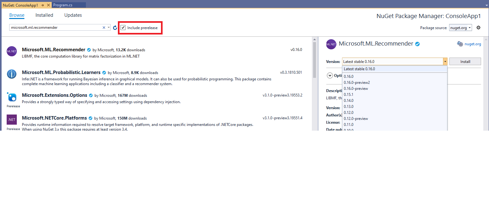

ML. NET Release Process
======================

This document describes the different kinds of ML. NET releases, how those releases are versioned, and how they are built.

Types of releases
--------------------

ML. NET NuGets (of which there are
approximately 25) are versioned with the following format: `A.B.C<-D>`, where `A`, `B`, and `C` are integers, and `D` is an optional string.

- `A` - **version number**: If `A` is 0, this NuGet is considered a **work in progress (WIP)**, and could be deleted at any time. If `A` is greater than 0, then we plan to support the corresponding NuGet indefinitely.
- `B` - **sub-version number**: This number is consistent within each GA release and within each WIP release. Therefore, all GA NuGets that are released at the same time will have the same sub-version number, and all WIP releases that are released at the same time will have the same sub-version number, but a WIP release and a GA release that are released at the same time may have different sub-version numbers.
- `C` - **patch index**: `C` starts at 0 and is incremented every time we introduce a bug fix between releases.
- `D` - **preview suffix**: `D` is an optional suffix which contains the word "preview" followed by an integer or by a datetime string and an integer. If D is not included and A is not 0, then the API surface is locked and will not change in future releases.

ML. NET has four kinds of releases: daily builds, previews, periodic general availability (GA), and fix. We detail each kind of release below.

1. **Daily builds:** these can be downloaded from [this NuGet feed](https://dev.azure.com/dnceng/public/_packaging?_a=feed&feed=MachineLearning), and are built automatically each time a commit is made to the `main` branch.
1. **Preview:** These releases are built from the corresponding `A.B-preview-X` GitHub branch, and are expected to meet a higher quality bar than the daily builds. These can also be downloaded from [this NuGet feed](https://dev.azure.com/dnceng/public/_packaging?_a=feed&feed=MachineLearning), or within Visual Studio, as detailed below. When we introduce new API's in a preview release, we avoid doing a GA release at the same time (unless there are patches required for the last GA release). If there are no new API's, then we go straight to a GA release and skip the preview release.
1. **GA:** These releases are built from the corresponding `A.B` GitHub branch. They are rigorously tested, stable, and meant for general use. They are also the default choice when installing ML. NET via the `Install-Package Microsoft.ML` command, and are published to [nuget.org](https://www.nuget.org/packages/Microsoft.ML/)
1. **Fix:** These releases include patches for bugs in either the preview or GA releases.

Versioning for releases
--------------------

The table below explains how each of the elements in our versioning schema would change, relative to the previous release, for each kind of release.

| Release type | Change in `A` | Change in `B` | Change in `C` | Change in `D` |
| -------------|-------------|-------------|-------------|-------------|
| Daily build | No change   | No change   | No change   | A date-like stamp is added, i.e. `Microsoft.Extensions.ML 1.5.0-preview-28327-2`   |
| Preview | No change | No change   | No change   | `preview` tag added to the most recent GA release, if this is the first preview, or preview index is incremented (i.e. `A.B.C-preview` -> `A.B.C-preview2`) |
| GA | Incremented for major releases, only for non-WIP NuGets. WIP NuGets maintain an `A` value of `0` | Incremented, or reset to 0 if `A` was incremented | Reset to 0 | `preview` tag is removed |
| Fix | No change | No change | Incremented | No change

> Note: to install the preview packages via the NuGet Package Manager in Visual Studio, you must make sure to check the "Include prerelease" checkbox:

