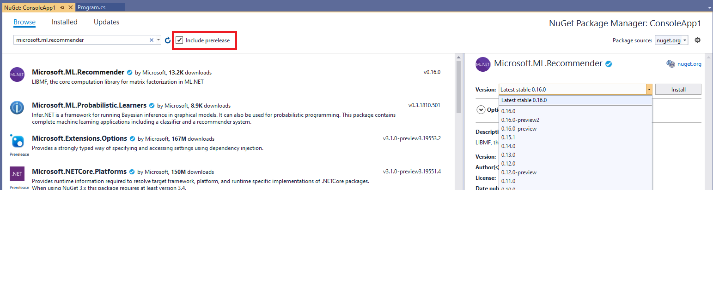

ML. NET Release Process
======================

This document describes the different kinds of ML. NET releases, how those releases are versioned, and how they are built.

Types of releases
--------------------

ML.NET NuGet packages (of which there are
approximately 25) are versioned with the following format: `A.B.C<-D>`, where `A`, `B`, and `C` are integers, and `D` is an optional string.

- `A` - **version number**: If `A` is 0, this NuGet is considered a **work in progress (WIP)**, and could be deleted at any time. If `A` is greater than 0, then we plan to support the corresponding NuGet indefinitely.
- `B` - **sub-version number**: This number is consistent within each GA release and within each WIP release. Therefore, all GA NuGet packages that are released at the same time will have the same sub-version number, and all WIP releases that are released at the same time will have the same sub-version number, but a WIP release and a GA release that are released at the same time may have different sub-version numbers.
- `C` - **patch index**: `C` starts at 0 and is incremented every time we introduce a bug fix between releases.
- `D` - **preview suffix**: `D` is an optional suffix which contains the word "preview" followed by an integer or by a datetime string and an integer. If D is not included and A is not 0, then the API surface is locked and will not change in future releases.

ML.NET has four kinds of releases: daily builds, previews, periodic general availability (GA), and fix. We detail each kind of release below.

1. **Daily builds:** these can be downloaded from [this NuGet feed](https://pkgs.dev.azure.com/dnceng/public/_packaging/dotnet-libraries/nuget/v3/index.json), and are built automatically each time a commit is made to the `main` branch.
1. **Preview:** These releases are built from the corresponding `A.B-preview-X` GitHub branch, and are expected to meet a higher quality bar than the daily builds. These can also be downloaded from [this NuGet feed](https://pkgs.dev.azure.com/dnceng/public/_packaging/dotnet-libraries/nuget/v3/index.json), or within Visual Studio, as detailed below. When we introduce new APIs in a preview release, we avoid doing a GA release at the same time (unless there are patches required for the last GA release). If there are no new APIs, then we go straight to a GA release and skip the preview release.
1. **GA:** These releases are built from the corresponding `A.B` GitHub branch. They are rigorously tested, stable, and meant for general use. They are also the default choice when installing ML.NET via the `dotnet add package Microsoft.ML` command, and are published to [nuget.org](https://www.nuget.org/packages/Microsoft.ML/)
1. **Fix:** These releases include patches for bugs in either the preview or GA releases.

Versioning for releases
--------------------

The table below explains how each of the elements in our versioning schema would change, relative to the previous release, for each kind of release.

| Release type | Change in `A` | Change in `B` | Change in `C` | Change in `D` |
| -------------|-------------|-------------|-------------|-------------|
| Daily build | No change   | No change   | No change   | A date-like stamp is added, i.e. `Microsoft.Extensions.ML 1.5.0-preview-28327-2`   |
| Preview | No change | No change   | No change   | `preview` tag added to the most recent GA release, if this is the first preview, or preview index is incremented (i.e. `A.B.C-preview` -> `A.B.C-preview2`) |
| GA | Incremented for major releases, only for non-WIP NuGets. WIP NuGets maintain an `A` value of `0` | Incremented, or reset to 0 if `A` was incremented | Reset to 0 | `preview` tag is removed |
| Fix | No change | No change | Incremented | No change

> Note: to install the preview packages via the NuGet Package Manager in Visual Studio, you must make sure to check the "Include prerelease" checkbox:



Creating a release branch
--------------------

When creating a new `release/<version>` branch:

1. Create the branch from the intended commit on `main` and configure the same branch protection rules as the previous release branch.
1. Copy the Arcade subscription from the previous release branch, changing the target branch and selecting the `.NET <version> Eng` channel associated with the new ML.NET release. Find the previous subscription ID with:

   ```powershell
   darc get-subscriptions `
     --target-repo https://github.com/dotnet/machinelearning `
     --target-branch release/<previous-version>
   ```

   Then create the subscription:

   ```powershell
   darc add-subscription `
     --subscription <previous-subscription-id> `
     --channel ".NET <dotnet-version> Eng" `
     --target-branch release/<version> `
     --quiet
   ```

   For example, the ML.NET 6.0 branch was configured by copying the ML.NET 5.0 subscription and moving it from `.NET 10 Eng` to `.NET 11 Eng`:

   ```powershell
   darc add-subscription `
     --subscription af328ac1-d1ef-44a8-9377-8e059ae63cd1 `
     --channel ".NET 11 Eng" `
     --target-branch release/6.0 `
     --quiet
   ```

   Merge the pull request that `darc` creates in the `maestro-configuration` repository before expecting dependency updates on the new branch.

   `darc` warns when a batchable subscription has no repository merge policies. This is expected for this repository: dependency-update pull requests are not automatically merged. Do not run `darc set-repository-policies` unless auto-merge is intentionally being enabled.

1. On `main`, update `eng/BranchInfo.props` for the next development cycle:
   - Increment `MajorVersion` for stable packages.
   - Increment `MinorVersion` for non-stable packages.
   - Leave both `PatchVersion` values at `0`.

   `PackageValidationBaselineVersion` and the Microsoft.ML.Tokenizers major version are derived from `MajorVersion` and do not normally require separate updates.

1. Verify representative stable, non-stable, and tokenizer package versions:

   ```powershell
   dotnet msbuild .\src\Microsoft.ML\Microsoft.ML.csproj -nologo -getProperty:PackageVersion
   dotnet msbuild .\src\Microsoft.ML.AutoML\Microsoft.ML.AutoML.csproj -nologo -getProperty:PackageVersion
   dotnet msbuild .\src\Microsoft.ML.Tokenizers\Microsoft.ML.Tokenizers.csproj -nologo -getProperty:PackageVersion
   ```
