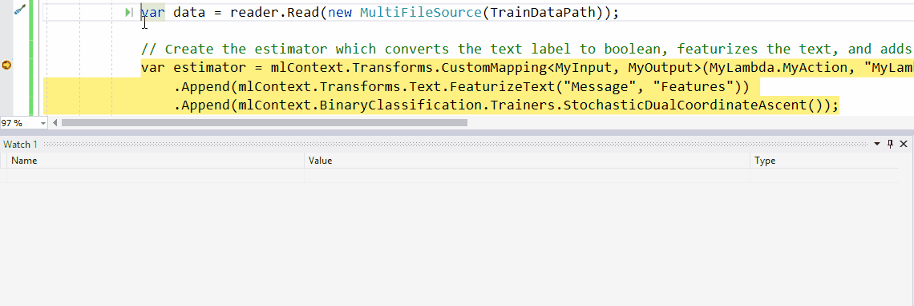

# ML.NET 0.8 Release Notes

Today we are excited to release ML.NET 0.8 and we can finally explain why it
is the best version so far! This release enables model explainability to
understand which features (inputs) are most important, improved debuggability,
easier to use time series predictions, several API improvements, a new
recommendation use case, and more.

### Installation

ML.NET supports Windows, MacOS, and Linux. See [supported OS versions of .NET
Core
2.0](https://github.com/dotnet/core/blob/master/release-notes/2.0/2.0-supported-os.md)
for more details.

You can install ML.NET NuGet from the CLI using:
```
dotnet add package Microsoft.ML
```

From package manager:
```
Install-Package Microsoft.ML
```

### Release Notes

Below are some of the highlights from this release.

* Added first steps towards model explainability
  ([#1735](https://github.com/dotnet/machinelearning/pull/1735),
  [#1692](https://github.com/dotnet/machinelearning/pull/1692))

    * Enabled explainability in the form of overall feature importance and
      generalized additive models. 
    * Overall feature importance gives a sense of which features are overall
      most important for the model. For example, when predicting the sentiment
      of a tweet, the presence of "amazing" might be more important than
      whether the tweet contains "bird". This is enabled through Permutation
      Feature Importance. Example usage can be found
      [here](https://github.com/dotnet/machinelearning/blob/3d33e20f33da70cdd3da2ad9e0b2b03df929bef4/docs/samples/Microsoft.ML.Samples/Dynamic/PermutationFeatureImportance.cs).
    * Generalized Additive Models have very explainable predictions. They are
      similar to linear models in terms of ease of understanding but are more
      flexible and can have better performance. Example usage can be found
      [here](https://github.com/dotnet/machinelearning/blob/3d33e20f33da70cdd3da2ad9e0b2b03df929bef4/docs/samples/Microsoft.ML.Samples/Dynamic/GeneralizedAdditiveModels.cs).

* Improved debuggability by previewing IDataViews
  ([#1518](https://github.com/dotnet/machinelearning/pull/1518))

    * It is often useful to peek at the data that is read into an ML.NET
      pipeline and even look at it after some intermediate steps to ensure the
      data is transformed as expected. 
    * You can now preview an IDataView by going to the Watch window in the VS
      debugger, entering a variable name you want to preview and calling its
      `Preview()` method. 

    

* Enabled a stateful prediction engine for time series problems
  ([#1727](https://github.com/dotnet/machinelearning/pull/1727))

    * [ML.NET
      0.7](https://github.com/dotnet/machinelearning/blob/483ec04a11fbdc056a88bc581d7e5cee9092a936/docs/release-notes/0.7/release-0.7.md)
      enabled anomaly detection scenarios. However, the prediction engine was
      stateless, which means that every time you want to figure out whether
      the latest data point is anomolous, you need to provide historical data
      as well. This is unnatural.
    * The prediction engine can now keep state of time series data seen so
      far, so you can now get predictions by just providing the latest data
      point. This is enabled by using `CreateTimeSeriesPredictionFunction`
      instead of `MakePredictionFunction`. Example usage can be found
      [here](https://github.com/dotnet/machinelearning/blob/3d33e20f33da70cdd3da2ad9e0b2b03df929bef4/test/Microsoft.ML.TimeSeries.Tests/TimeSeriesDirectApi.cs#L141).
      You'll need to add the Microsoft.ML.TimeSeries NuGet to your project.

* Improved support for recommendation scenarios with implicit feedback
  ([#1664](https://github.com/dotnet/machinelearning/pull/1664))  

    * [ML.NET
      0.7](https://github.com/dotnet/machinelearning/blob/483ec04a11fbdc056a88bc581d7e5cee9092a936/docs/release-notes/0.7/release-0.7.md)
      included Matrix Factorization which enables using ratings provided by
      users to recommend other items they might like.
    * In some cases, you don't have specific ratings from users but only
      implicit feedback (e.g. they watched the movie but didn't rate it).
    * Matrix Factorization in ML.NET can now use this type of implicit data to
      train models for recommendation scenarios. 
    * Example usage can be found
      [here](https://github.com/dotnet/machinelearning/blob/71d58fa83f77abb630d815e5cf8aa9dd3390aa65/test/Microsoft.ML.Tests/TrainerEstimators/MatrixFactorizationTests.cs#L335).
      You'll need to add the Microsoft.ML.MatrixFactorization NuGet to your
      project. After ML.NET 0.9, please switch to Microsoft.ML.Recommender
      Nuget.

* Enabled saving and loading data as a binary file (IDataView/IDV)
  ([#1678](https://github.com/dotnet/machinelearning/pull/1678))

    * It is sometimes useful to save data after it has been transformed. For
      example, you might have featurized all the text into sparse vectors and
      want to perform repeated experimentation with different trainers without
      continuously repeating the data transformation.
    * Saving and loading files in ML.NET's binary format can help efficiency
      as it is compressed and already schematized.
    * Reading a binary data file can be done using
      `mlContext.Data.ReadFromBinary("pathToFile")` and writing a binary data
      file can be done using `mlContext.Data.SaveAsBinary("pathToFile")`.

* Added filtering and caching APIs
  ([#1569](https://github.com/dotnet/machinelearning/pull/1569))

    * There is sometimes a need to filter the data used for training a model.
      For example, you need to remove rows that don't have a label, or focus
      your model on certain categories of inputs. This can now be done with
      additional filters as shown
      [here](https://github.com/dotnet/machinelearning/blob/71d58fa83f77abb630d815e5cf8aa9dd3390aa65/test/Microsoft.ML.Tests/RangeFilterTests.cs#L30).

    * Some estimators iterate over the data multiple times. Instead of always
      reading from file, you can choose to cache the data to potentially speed
      things up. An example can be found
      [here](https://github.com/dotnet/machinelearning/blob/71d58fa83f77abb630d815e5cf8aa9dd3390aa65/test/Microsoft.ML.Tests/CachingTests.cs#L56).

### Acknowledgements

Shoutout to [jwood803](https://github.com/jwood803),
[feiyun0112](https://github.com/feiyun0112),
[bojanmisic](https://github.com/bojanmisic),
[rantri](https://github.com/rantri), [Caraul](https://github.com/Caraul),
[van-tienhoang](https://github.com/van-tienhoang),
[Thomas-S-B](https://github.com/Thomas-S-B), and the ML.NET team for their
contributions as part of this release! 
