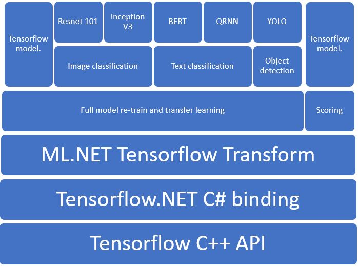

# [ML.NET](http://dot.net/ml) 1.3.1

## **New Features**
- **Deep Neural Networks Training (PREVIEW)** ([#4057](https://github.com/dotnet/machinelearning/pull/4057))
  Introduces in-preview 0.15.1 `Microsoft.ML.DNN` package that enables full DNN model retraining and transfer learning in .NET using C# bindings for tensorflow provided by Tensorflow .NET. The goal of this package is to allow high level DNN training and scoring tasks such as image classification, text classification, object detection, etc using simple yet powerful APIs that are framework agnostic but currently they only uses Tensorflow as the backend. The below APIs are in early preview and we hope to get customer feedback that we can incorporate in the next iteration.

  

  ```cs
  public static DnnEstimator RetrainDnnModel(
            this ModelOperationsCatalog catalog,
            string[] outputColumnNames,
            string[] inputColumnNames,
            string labelColumnName,
            string tensorFlowLabel,
            string optimizationOperation,
            string modelPath,
            int epoch = 10,
            int batchSize = 20,
            string lossOperation = null,
            string metricOperation = null,
            string learningRateOperation = null,
            float learningRate = 0.01f,
            bool addBatchDimensionInput = false,
            DnnFramework dnnFramework = DnnFramework.Tensorflow)

  public static DnnEstimator ImageClassification(
            this ModelOperationsCatalog catalog,
            string featuresColumnName,
            string labelColumnName,
            string outputGraphPath = null,
            string scoreColumnName = "Score",
            string predictedLabelColumnName = "PredictedLabel",
            string checkpointName = "_retrain_checkpoint",
            Architecture arch = Architecture.InceptionV3,
            DnnFramework dnnFramework = DnnFramework.Tensorflow,
            int epoch = 10,
            int batchSize = 20,
            float learningRate = 0.01f,
            bool measureTrainAccuracy = false)

  ```

  [Design specification](https://github.com/dotnet/machinelearning/blob/cd591dd492833964b6829e8bb2411fb81665ac6d/docs/specs/DNN/dnn_api_spec.md)

  [Image classification (Inception V3) sample](https://github.com/dotnet/machinelearning/blob/main/docs/samples/Microsoft.ML.Samples/Dynamic/ImageClassification/InceptionV3TransferLearning.cs)

  [Image classification (Resnet V2 101) sample](https://github.com/dotnet/machinelearning/blob/main/docs/samples/Microsoft.ML.Samples/Dynamic/ImageClassification/ResnetV2101TransferLearning.cs)

- **Database Loader (PREVIEW)** ([#4035](https://github.com/dotnet/machinelearning/pull/4035))
  Introduces Database loader that enables training on databases. This loader supports any relational database supported by System.Data in .NET Framework or .NET Core, meaning that you can use many RDBMS such as SQL Server, Azure SQL Database, Oracle, PostgreSQL, MySQL, etc. This feature is in early preview and can be accessed via `Microsoft.ML.Experimental` nuget.

  [Design specification](https://github.com/dotnet/machinelearning/pull/3857)

  [Sample](https://github.com/dotnet/machinelearning/blob/main/test/Microsoft.ML.Tests/DatabaseLoaderTests.cs)

  ```cs
  public static DatabaseLoader CreateDatabaseLoader(this DataOperationsCatalog catalog,
            params DatabaseLoader.Column[] columns)
  ```

## **Bug Fixes**
### Serious
- **SaveOnnxCommand appears to ignore predictors when saving a model to ONNX format:** This broke export to ONNX functionality. ([3974](https://github.com/dotnet/machinelearning/issues/3974))

- **Unable to use fasterrcnn onnx model**. ([3963](https://github.com/dotnet/machinelearning/pull/3963))

- **PredictedLabel is always true for Anomaly Detection:** This bug disabled scenarios like fraud detection using binary classification/PCA. ([#4039](https://github.com/dotnet/machinelearning/pull/4039))

- **Update build certifications:** This bug broke the official builds because of outdated certificates that were being used. ([#4059](https://github.com/dotnet/machinelearning/pull/4059))

### Other
- **Stop LightGbm Warning for Default Metric Input:** Fixes warning, LightGBM `Warning Unknown parameter metric=` is produced when the default metric is used. ([#3965](https://github.com/dotnet/machinelearning/pull/40079))

## **Samples**
- [**Fraud Detection using the anomaly detection PCA trainer**](https://github.com/dotnet/machinelearning-samples/tree/main/samples/csharp/getting-started/AnomalyDetection_CreditCardFraudDetection)

## **Breaking Changes**
None

## **Enhancements**
- Farewell to the Static API ([4009](https://github.com/dotnet/machinelearning/pull/4009))

- AVX and FMA intrinsics in Factorization Machine ([3940](https://github.com/dotnet/machinelearning/pull/3940))

## **CLI and AutoML API**
  - Bug fixes.

## **Remarks**
- [**Machine Learning at Microsoft with ML.NET**](https://arxiv.org/pdf/1905.05715.pdf) is presented at [KDD 2019 Proceedings](https://www.kdd.org/kdd2019/proceedings)


