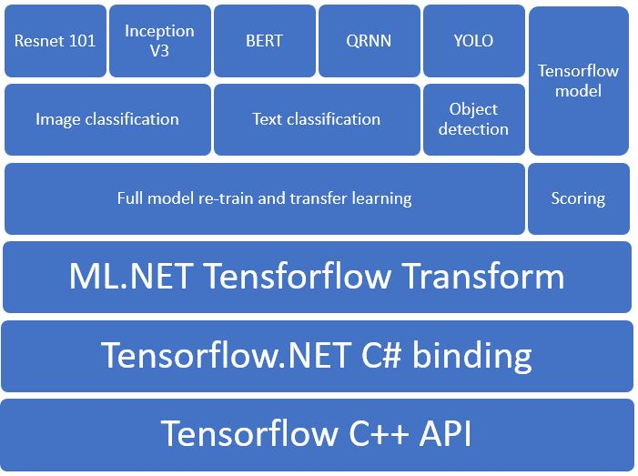

# Deep Neural Network support in ML .NET
## Motivation
To improve solutions for scenarios such as image and text classification and object detection. Currently we have Tensorflow and ONNX transfomers that enable scoring of Tensorflow and ONNX models within the pipeline. We now want to enable full model training and transfer learning and create APIs that enhance and also make it easy to do the above outlined tasks. 

## Solution
ML .NET does not have a DNN training infrastructure so we plan to use Tensforflow in the backend through the C# bindings created by [Tensorflow .NET](https://github.com/SciSharp/TensorFlow.NET). 




### Tensorflow transform flow  


### Transfer learning

The below example shows transfer learning on resnet 101 done using ML .NET tensorflow transform. The picture consists of three graphs. The first graph is the original frozen resnet v2 101 model, the second graph is the same model converted to its mete graph file with transfer learning layer added and connected to the output of its second last layer that contains features. The third graph contains the frozen resnet v2 101 graph with the last layer replaced with the transfer learnt layer model.


## Scenarios
### Image classification APIs (Preview release in v1.3)
- Load model (already exist)
  ```C#
    public static TensorFlowModel LoadTensorFlowModel(
        this ModelOperationsCatalog catalog,
        string modelLocation,
        bool metaGraph = false) 
  ```
-  Re-train / Transfer learning on a model.
  ```C#
        public TensorFlowEstimator RetrainTensorFlowModel(
            string[] outputColumnNames,
            string[] inputColumnNames,
            string labelColumnName,
            string tensorFlowLabel,
            string optimizationOperation,
            bool reTrain,
            string finalTensorName,
            string bottleneckOperationName,
            int epoch = 10,
            int batchSize = 20,
            string lossOperation = null,
            string metricOperation = null,
            string learningRateOperation = null,
            float learningRate = 0.01f,
            bool addBatchDimensionInput = false)
  ```
- Score Tensorflow model (already exist)
  ```C#
    public TensorFlowEstimator ScoreTensorFlowModel(
        string[] outputColumnNames,
        string[] inputColumnNames,
        bool addBatchDimensionInput = false)
  ```
- Image classification model building
  ```C#
    public TensorFlowEstimator ImageClassificationTrain(
        string[] outputColumnNames,
        string[] inputColumnNames,
        string labelColumnName,
        enum Model)
  ```
- Image classification scoring
  ```C#
    public TensorFlowEstimator ImageClassification(
        string[] outputColumnNames,
        string[] inputColumnNames,
        enum Model)
  ```

### Text classification
### Object detection