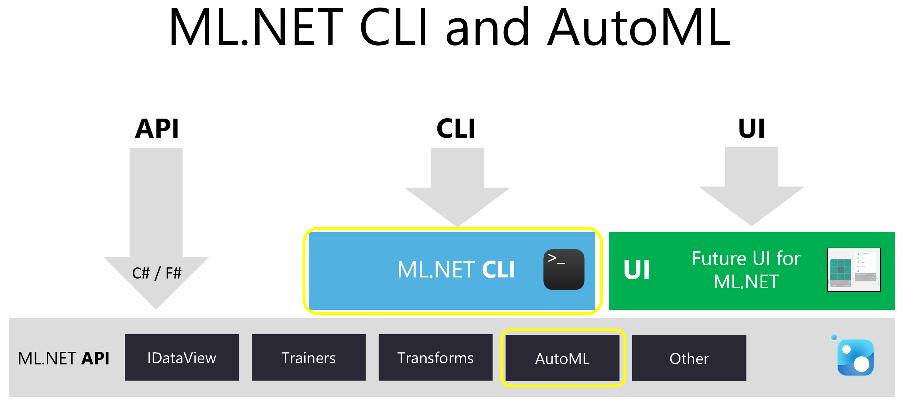
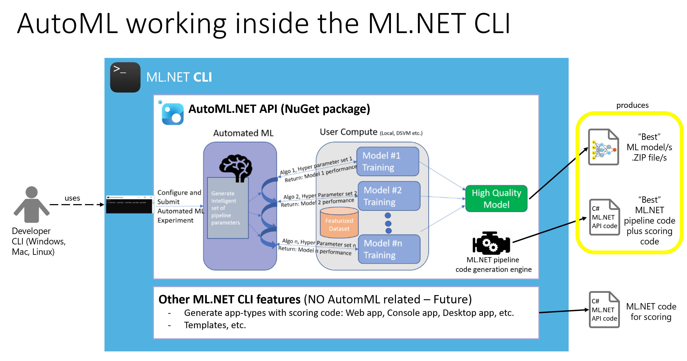
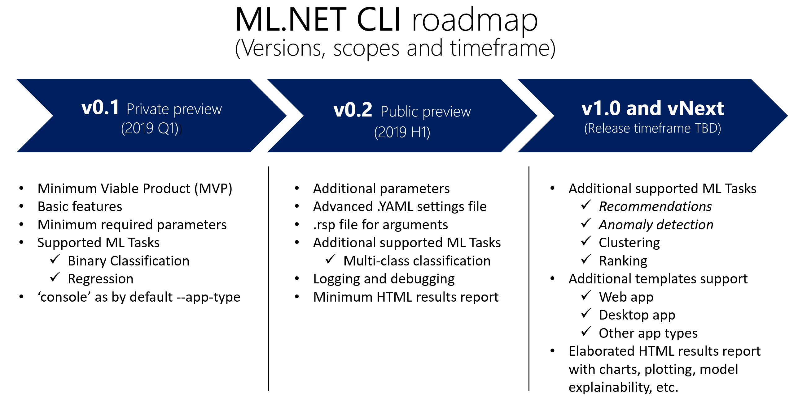
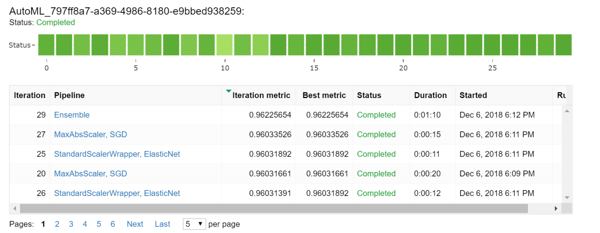
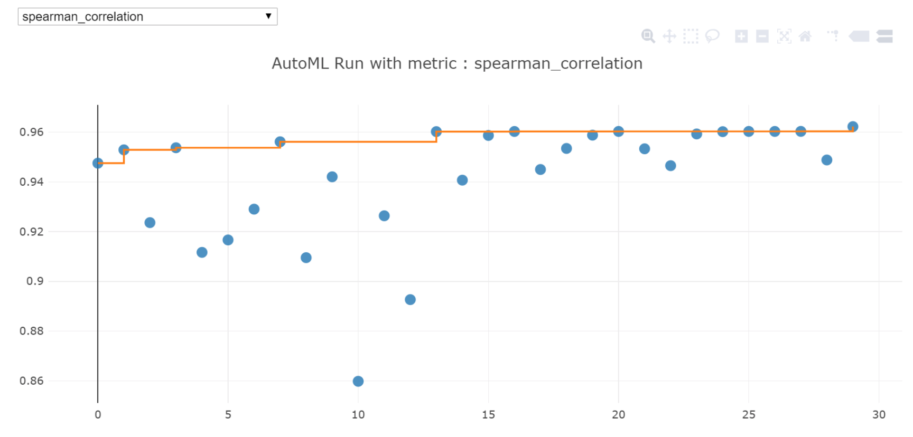

# Specs for the ML.NET CLI with AutoML

## Context

**Commitments: This specs document is 100% aspirational and will change while it's being discussed and implementation is evolving based on feedback. There are no commitments derived from this document except for the first upcoming minor version at any given time (v0.1, initially).**

The CLI will be branded as the ML.NET CLI since this CLI will also have additional features in addition to AutoML features.

The .NET AutoML API (.NET based) will be part of the [ML.NET](https://github.com/dotnet/machinelearning) API.
AutoML features will be used for certain important foundational features of the ML.NET CLI.

This specs-doc focuses most of all on the CLI features related to AutoML, but it will also consider (in less detail) the scenarios where AutoML is not needed, so the CLI syntax will be consistent end-to-end for all the possible scenarios in the future.

# Problem to solve

Customers (.NET developers) have tolds us through many channels that they can get started with [ML.NET](https://github.com/dotnet/machinelearning) and follow the initial simple examples. However, as soon as they have to create their own model to solve their problems, they are blocked because they don't know what learner/algorithms are better for them to pick and use, what hyper-parameters to use or even what data transformations they need to do.

The subset of .NET developers who at the same time are skilled on data science and machine learning in general is very small compared to the total number of regular .NET developers.

We need a way to enable regular .NET developers to easily use [ML.NET](https://github.com/dotnet/machinelearning) to create custom models solving typical ML scenarios in the enterprise.

If we don't provide a really simple way to use [ML.NET](https://github.com/dotnet/machinelearning) for regular developers (almost no data science knowledge at all), then we won't be able to really "democratize" machine learning for .NET developers.

## Evidence

Sample feedback and quotes:

- *"My blocking issues?: Understanding the pros and cons of various classifiers that are available in libraries and how best to use a  combination. What shoud I use?"*

- *"I'm missing too much ML knowledge. Would be great to know when to pick which learner or if the platform would tell me?"*

- *“It’s confusing to know what tools to use to solve a particular problem.  All of the classes use the language of machine learning experts.”*

- *"lack of hints on the relative benefits of using alternative algorithms”*

- *"Personally - My understanding of certain areas, the samples online are great, however I've found it difficult to deviate from the set pattern (possibly intentional?) which has made it an uphill struggle trying to achieve what I want to"*

- *"Remember that not all of us are trained as statisticians. One example: "FastTree" trainer, we can change "numTrees" and "numLeaves" for example, and the documentation says "Total number of decision trees to create in the ensemble." Okay, but what should I do now ? I have 90'000 data points, should I create 100, 900, 2000 trees ?"*

- *“To be honest, the AI/ML communities do a terrible job of explaining what the heck they're doing to the average developer. For example the Standford lectures that go into GloVe, etc. are talking about taking the derivatives of a formula by lecture 2. Or at the other extreme it's a toy example with no actual explanation of what the heck is going on, just copy this code and run it. Or I have to deal with the fact that every example is done in Python and Jupyter."*

- *"BUT if you want it to really get more use outside of the weird people like me, you need a huge amount of documentation, examples, blog posts, etc. that takes people from 0 knowledge to actual production usage. You need something ELSE to really be a game-changer here for regular developers who are not data scientists"*

# Who is the Customer

- Regular .NET developers getting started with machine learning while trying to use .NET (C# and F# most of all) for ML.

- Specific developer roles are: enterprise developers, start-up developers, ISV developers and internal MSFT teams developers.


# Goals

The business goals are the following, depending on the possible scenarios:

- **"New to ML" scenario: (Previews)** Regular .NET developer with minimum or no data science skills is able to go from raw data to working model.

- **"Productivity plus quality" scenario: (Previews)** .NET developers with good data science skills is able to significantly improve productivity when creating a model while making sure they get the best model even when they might know the label, features to use, etc. but need to maximize accuracy, infer speed and other metrics without spending much time on custom low-level experiments.

- **"ML.NET learning and customization" scenario: (Previews)** .NET developers are able to research the generated pipeline's implementation code (C# + ML.NET API) for customization of the generated ML.NET code.

- **"Cross-platform" scenario: (Previews)** .NET developers are able to use the ML.NET CLI from the same OS supported by .NET Core: Windows, Mac and Linux, so they are not tied to a single environment like Windows and VisualStudio but can be used from any OS CLI and code editor.

- **"Advanced ML learning and customization" scenario: (v0.2)** Developers with ML skills are able to customize internal ML parameters such as trainerexclusion/inclusion lists, specific featurization, metrics to prioritize, etc. for more advanced learning and customization of the generated models and ML.NET code and even to improve total execution times by providing certain prescriptive ML "shortcuts".

- **Azure integration for scaling-out (v1.0 or vNext)**: In next versions, an important goal will be to be able to scale-out the explorations and training in parallel tasks deployed into Azure in addition to running it on a local PC. AutoML in Azure is a great example, but regular training of a model could also be performed in Azure.

The goals for the features is to automate the following steps when building a model to achieve the above business goals:

**Foundational features:**

- Provide an end-to-end **ML.NET CLI** for developers (i.e. *"mlnet new"*) to generate either the final trained model and the pipeline's C#/ML.NET implementation code in a similar fashion to the [.NET Core CLI](https://docs.microsoft.com/en-us/dotnet/core/tools/?tabs=netcore2x). The CLI is also a foundation upon which higher-level tools, such as Integrated Development Environments (IDEs) can rest.
- Automatic selection of best columns (input variables) to be used by the model
- Automatic featurization and feature engineering
- Automatic learner sweeping and selection
- Automatic hyperparameter sweeping and selection


# Solution

The solution that can target any kind of developer and fits especially well when generating code is a CLI (Command-Line Interface).

The main support reasons are:

- A CLI can be the foundation where other higher level tooling (UI, IDEs) can also rest on.
- A CLI makes sense as a tool for "code generation". For the end-user experience, just using a C# API to generate C# code would not make sense and would feel a bit weird for the developer experience used to .NET approaches.
- A CLI is aligned to modern cross-platform frameworks experience such as .NET Core, Python, Node, etc.

## Positioning the CLI and AutoML in ML.NET



As mentioned at the begining of the spec doc, the CLI will be branded as the ML.NET CLI since this CLI will also have additional features where AutoML is not needed.

The .NET AutoML API will be used for the most important foundational features that will be part of the ML.NET CLI, though, as shown in the following diagram:




## Design criteria

- The ML.NET CLI will create **four main types of results** related to AutoML:
    - Best trained models (Serialized model files, such as .ZIP files).
    - C# ML.NET sample code consuming/scoring the models.
    - C# ML.NET pipeline implementation code for each possible "best model" configuration.
    - Result report with ML analysis of the models (*Mostly since v1.0*)

- The ML.NET CLI automation will be able to run locally, on any development environment PC (Windows, Mac or Linux).
- Future versions will be able to run AutoML compute and other compute processes (such as a regular model training) in Azure.
- The ML.NET CLI  will consume the AutoML API (Microsoft.ML.Auto NuGet package) which will only consume public surface of ML.NET.
- The CLI proposed here will not provide for “continue sweeping” after sweeping has ended.
- When running locally with the by default behavior (no Azure), the CLI will be able to work without needing to make any remote service call or requiring any authentication from the user.
- The CLI will provide feedback output (such as % work done or high level details on what's happening under the covers) while working on the long-running tasks.
- The ML.NET CLI will be aligned and integrated to the [.NET Core CLI](https://docs.microsoft.com/en-us/dotnet/core/tools/?tabs=netcore2x). A good approach is to implement the ML.NET CLI as a [.NET Core Global Tool](https://docs.microsoft.com/en-us/dotnet/core/tools/global-tools) (i.e. named "mlnet" package) on top of the "dotnet CLI".
  - [System-Command-Line](https://github.com/dotnet/command-line-api) package can precisely help on those typical CLI console apps features (CLI plumbing) so if can be implemented a lot easier than by implementing a CLI app from scratch in features like command line parsing, invocation and rendering of terminal output. Otherwise, a CLI implementation starting from scratch can be significantly more costly to develop.

### CLI default behaviour and overridability

The CLI will have default behavior for each of these mentioned features – however the CLI by default settings should be able to be overridden by providing new/overriden values in the console command (and optionally the advanced configuration .YAML file and response file .rsp placed along with the CLI executable).

# Roadmap: Versions, timeframe and scope

The following is a high-level plan targeting multiple versions, timeframe and scope per each version.




The detailed features per scope and version are explained in the following sections.

The conditions for each version are incremental on top of previous versions.

## Gated conditions for v0.1 Private Preview (2019-Q1)

- Supported ML Tasks
    - Binary Classification
    - Regression

- NuGet package available at any private NuGet feed ([Azure DevOps?](https://docs.microsoft.com/en-us/azure/devops/artifacts/get-started-nuget?view=azure-devops&tabs=new-nav) [MyGet?](https://docs.myget.org/docs/reference/security)) with daily drops from CI/CD pipelines.

- Add telemetry for the CLI NuGet package.

- Minimum MVP functionality for users to test custom datasets. Implementation of the CLI arguments especified for v0.1 in the syntax section and code generation section.

- Documentation: Have needed documentation for users to get started autonomously and provide feedback (Installation, getting started and test without help from the dev team).

- Test with ML.NET Samples: Quality of generated code/models targeting the samples should improve the current published samples.

Nice to have for v0.1:

- Generate code using a data structure class with "vector valued columns" when loading hundreds of columns.

- Implement the `--app-type` argument with 'console' as the by default app.

## Gated conditions for v0.2 Public Preview (2019-H1)

- NuGet package available at the public NuGet feed (major version) and MyGet feed for minor version previews (daily drops).
- Additional supported ML Tasks
    - Multi-class classification

- Cache support

- Use of model definition file `--model-settings-file` (.yaml file) for loading model's fine-grain settings. Also, generate the the .yaml file with the infered settings even if a .yaml file was not used, so the user can learn how to customize by using that model definition file and can re-run it, too.

- Use of response file `[<RSP FILE NAME>]` to load the CLI arguments from a file. Also, when user run new, the RSP of current executed commands can be added to the generated project so that it can be re-ran by the user.
    - Note: Pending to decide if .RSP is needed or the .YAML file is enough.

- Autocomplete for CLI arguments installed automatically.

- Generate the number of "best models" (project folders and file models) specified by `--best-models-count`

- Simple HTML report with minimum models' metrics.

- Have a CLI sample per each ML.NET sample.


## Gated conditions for v1.0 GA (Release timeframe TBD)

- Additional supported ML Tasks
    - Recommendations
    - Anomaly detection

- Quality and benchmark conditions (TBD by the ML.NET and AutoML teams)

- Azure support for exploring models and training (or vNext? - TBD)

- Additional parameters in the .YAML settings file:
    - `id_column`       // used to uniquely identify the row in dataset
    - `groupid-column` // groups examples. Often used for Ranking
    - `weight-column`  // indicates the weight/importance of training example. Related: `sample_weight` argument for training data such as in [Python AutoML here](https://docs.microsoft.com/en-us/python/api/azureml-train-automl/azureml.train.automl.automl?view=azure-ml-py).

- Add additonal commands to do *"machine learning without code"*:
    - *train*: It will only generate the best model .ZIP file. For example:
        - `mlnet train --ml-task Regression --dataset "/MyDataSets/Sales.csv"`
    - *predict*: Having a serialized model .ZIP file, you can test a single prediction. For example:

        - `mlnet predict –-model_path <path to model> –input-sample “title=foo,description=blah”`
        - `mlnet predict –-model_path <path to model> –input-data-path “path”`

- Additional scoring app templates support
    - Console (multi-project solution)
    - Web app (multi-project solution)
    - Service WebAPI (multi-project solution)

- Complete HTML report with model's metrics.


## Additional features for vNext  (Release timeframe TBD)

- Additional supported ML Tasks
    - Clustering
    - Ranking

- Support for additional dataset formats in addition to text files, such as IDV or some other format.We might want to add a readertype followed by args specific to that reader.

- *F#* code generation

- Integration with Visual studio "Add... -> New Project"

- Additional scoring app templates support
    - Unity (multi-project solution)
    - Desktop-WPF app (multi-project solution)
    - Desktop-UWP app (multi-project solution)

- Additional improvements
    - Generate simplified code for additional Trainere (with no Options class in trainer) when advanced Hyper-Params are not used. This is already done for Binary-Classification and Regression.


# CLI usage

## Tool name

**mlnet**

## Installing the tool

If implemented as a [Global Tool](https://docs.microsoft.com/en-us/dotnet/core/tools/global-tools) NuGet package, you use the [dotnet tool install](dotnet-tool-install.md) .NET Core CLI command. The following example shows how to install a Global Tool in the default location:

```console
dotnet tool install -g mlnet
```

## Using the tool

Once the tool is installed, you can call it by using its command. Note that the command may not be the same as the package name.

You can use it with:

```console
mlnet
```

## Command 'new'

`mlnet new` will create the following assets:

- A new project or group of projects (by default, a single console app) with the generated .NET code.
- The "best model" (or multiple "best models") as serialized files.
- An analysis report of the generated models.

By default (with no app template parameter), the CLI will create a single console application containing either the training code and the model scoring code. However, in next ML.NET CLI versions (heading v1.0), when the user provides an app-type template argument (such as `mlnet new web`), it will be able to generate different application type projects (web, console, desktop, Unity, etc.) for the model scoring code.

## Examples

Simplest CLI command for a binary classification problem (AutoML will need to infer most of the configuration from the provided data):

(*Release 0.1 examples*)

` mlnet new --ml-task BinaryClassification --dataset "/MyDataSets/Cars.csv"`

Another simple CLI command for a regression problem where the target-column is provided explecitely:

` mlnet new --ml-task Regression --dataset "/MyDataSets/Sales.csv" --label-column "MonthlySales" `

Create and train a binary-classification model with quite a few explicit arguments:

` mlnet new --ml-task BinaryClassification --app-type console --dataset "/MyDataSets/Population-Training.csv" --test-dataset "/MyDataSets/Population-Test.csv" --label-column-name "InsuranceRisk" --max-exploration-time 600`

Create and train a model based on arguments specified in the CLI response file (.rsp) with arguments containing the configuration:

` mlnet new @my_cli_config_args.rsp`


(*Release 0.2 examples*)

Simplest command where the tool infers the type of ML taks to perform based on the data:

` mlnet new --dataset "/MyDataSets/Cars.csv"`

Create and train a model based on parameters specified in the .rsp file plus more advanced model settings in the .yaml file:

` mlnet new @my_cli_config_args.rsp --model-settings-file "./my_model_settings.yaml"  `


(*Release v1.0 examples*)

CLI command specifying to run AutoML compute in Azure's cloud

` mlnet new --ml-task BinaryClassification --dataset "/MyDataSets/Cars.csv" --label-column-name "InsuranceRisk" --azure-automl-service-key "key-value"`


Syntax should be aligned to [dotnet new](https://docs.microsoft.com/en-us/dotnet/core/tools/dotnet-new?tabs=netcore21#synopsis).

#### Syntax

```console
mlnet new

--------------- (v0.1) -------------------

--ml-task <value>

--dataset <value>
[
 [--validation-dataset <value>]
  --test-dataset <value>
]

--label-column-name <value>
|
--label-column-index <value>

[--has-header <value>]

[--max-exploration-time <value>]
[--verbosity <value>]

[--name <value>]
[--output-path <value>]

[-h|--help]

-------------- (v0.2) --------------------
[--ml-task <value>]
[--model-settings-file <value>]
[<RSP FILE NAME>]
[--cache]
[--best-models-count]
[--list-ml-tasks]
[--app-type <value>]
[--force]

-------------- (v1.0) --------------------
[--list-app-types]
[--debug-log-file <value>]
------------------------------------------

-------------- (vNext) -------------------
[-lang|--language <value>]
------------------------------------------

```

#### Description

The `mlnet new` command provides a CLI oriented way to create projects or solutions such as:

- Create a single project (console app) with:
    - *Training ML.NET code:* One seggregated method per ranked model, but part of the same console app.
    - *Scoring/consuming ML.NET code:* One seggregated method per ranked model, but part of the same console app.
    - *Trained model files:* Multiple ranked trained models in the form of several .ZIP files.

Optionally (*but in vNext CLI versions such as v1.0 or later*), depending on the used `--app-type argument`, it could also create a solution, such as:

- Create a solution (multiple projects) with:
    - *Training project:* Console project with model-training ML.NET code
    - *Common-code project:* Class library project with common code (Data/Observation class, Prediction class, etc.
    - *End-user-app project:* End-user application type (depending on template) with ML.NET code scoring the model/s.
    - *Trained models:* Multiple ranked trained models in the form of several .ZIP files.


### Arguments

Invalid input of arguments should cause it to emit a list of valid inputs and an error message explaining which arg is missing, if that is the case.

There should be a pre-validation of the arguments with basic rules in the CLI tool being performed before the internal AutoML process starts, so most of the invalid input arguments are catch or validated upfront, so in case there's any invalid input the user will know it in advanced instead of after minutes.

----------------------------------------------------------

`--ml-task` (string) (*Release 0.1*)

A single string providing the ML problem to solve. For instance, any of the following depending on the supported tasks in .NET AutoML:

*Release 0.1*
- `regression` - Choose if the ML Model will be used to predict a numeric value
- `binary-classification` - Choose if the ML Model result has two possible values.

*Release 0.2*
- `multiclass-classification` - Choose if the ML Model result has a limited number of values.
- Infer what's the *label column* in the dataset when the user didn't provide the `--label-column` argument.

*Release 1.0*
- `recommendations`
- `anomaly-detection`

*Release vNext*
- `clustering`
- `ranking`


 Only one ML task should be provided here.

 ----------------------------------------------------------

`--dataset` (string) (*Release 0.1*)

This argument provides the filepath to either one of the following:

- *A: The whole dataset file:* If using this option and the user is not providing `--test-dataset` and `--validation-dataset`, then cross-validation (k-fold, etc.) or automated data split approaches will be used internally for validating the model. I nthat case, the user will just need to provide the dataset filepath.

- *B: The training dataset file:* If the user is also providing datasets for model validation (using `--test-dataset` and optionally `--validation-dataset`), then the `--dataset` argument means to only have the "training dataset". For example when using a 80% - 20% approach to validate the quality of the model and to obtain accuracy metrics, the "training dataset" will have 80% of the data and the "test dataset" would have 20% of the data.

----------------------------------------------------------

`--test-dataset` (string) (*Release 0.1*)

File path pointing to the test dataset file, for example when using a 80% - 20% approach when making regular validations to obtain accuracy metrics.

If using `--test-dataset`, then `--dataset` is also required.

The `--test-dataset` argument is optional unless the --validation-dataset is used. In that case, the user must use the three arguments.

----------------------------------------------------------

`--validation-dataset` (string) (*Release 0.1*)

File path pointing to the validation dataset file. The validation dataset is optional, in any case.

If using a `validation dataset`, this is how the behaviour should be:

- The `test-dataset` and `--dataset` arguments are also required.

- The `validation-dataset` dataset is used to estimate prediction error for model selection.

- The `test-dataset` is used for assessment of the generalization error of the final chosen model. Ideally, the test set should be kept in a “vault,” and be brought out only at the end of the data analysis.

Basically, when using a `validation dataset` plus the `test dataset`, the validation phase is split into two parts:

1. In the first part you just look at your models and select the best performing approach using the validation data (=validation)
2. Then you estimate the accuracy of the selected approach (=test).

Hence, the separation of data could be 80/10/10 or 75/15/10. For example:

- `training-dataset` file should have 75% of the data.
- `validation-dataset` file should have 15% of the data.
- `test-dataset` file should have 10% of the data.

In any case, those percentages will be decided by the user using the CLI who will provide the files already split.

----------------------------------------------------------

`--label-column-name` (string) (*Release 0.1*)

With this argument, a specifc objective/target column (the variable that you want to predict) can be specified by using the column's name set in the dataset's header.

If you do not explicitly specify a label column, the CLI will automatically infer what's the label column in the dataset (To be implemented in v0.2 or v1.0).

This argument is used only for supervised ML task such as a *classification problem*. It cannot be used for unsupervised ML Tasks such as *clustering*.

----------------------------------------------------------

`--label-column-index` (int) (*Release 0.1*)

With this argument, a specifc objective/target column (the variable that you want to predict) can be specified by using the column's numeric index in the dataset's file (Starting on 1. First column would be 1).

*Note:* If the user is also using the `--label-column-name`, the `--label-column-name` is the one being used.

If you do not explicitly specify a label column, the CLI will to automatically infer what's the label column in the dataset (To be implemented in v0.2 or v1.0).

This argument is used only for supervised ML task such as a *classification problem*. It cannot be used for unsupervised ML Tasks such as *clustering*.

----------------------------------------------------------

`--has-header` (bool) (*Release 0.1*)

Specify if the dataset file(s) have a header row.
Possible values are:
- `true`
- `false`

The by default value is `true`.

In order to use the `--label-column-name` argument you need to have a header in the file.

----------------------------------------------------------

`--max-exploration-time` (string) (*Release 0.1*)

Currently, the by default exploration time (timeout) is 10 seconds.

This argument allows to set the maximum wished time (in seconds) for the process to explore multiple trainers and configurations. It is a "wished" or "aspirational" time because if the provided time is too short (say 2 seconds), the time it'll take will be the needed time for a single iteration until one model configuration can be returned.

The needed time for iterations can vary depending on the size of the dataset.
Therefore, if `--max-exploration-time` is very short (say less than 1 minute), the process should use just just a few hundred rows if the dataset is large.

----------------------------------------------------------

`--name` (string) (*Release 0.1*)

The name for the created output project or solution. If no name is specified, the name 'Sample' is used.

The ML.NET model file (.ZIP file) will get the same name, as well.

If the request is to create multiple models/projects, the name of each folder and model .zip file will use the provided name as prefix plus '_1', '_2' and so forth depending on the requested models.

----------------------------------------------------------

`--output-path` (string) - (*Release 0.1*)

Location/folder to place the generated output. The default is the current directory.

----------------------------------------------------------

`--verbosity` (string) - (*Release 0.1*)

Sets the verbosity level of the in the std output.

Allowed values are:

- `q[uiet]`
- `m[inimal]`  (by default)
- `diag[nostic]` (logging information level)

By default, the CLI tool should show some minimum feedback (minimal) when working, such as mentioning that it is working and if possible how much time is left or what % of the time is completed.

----------------------------------------------------------

`-h|--help` - (*Release 0.1*)

Prints out help for the command. It can be invoked for the `mlnet new` command itself or for any template, such as `mlnet new --help`.

The --help output should include most common examples, since there can be many combinations of options here with no indication of which combinations are valid until you actually try it.

----------------------------------------------------------

`--cache` - (*Release 0.2*)

Specify if training will use cache for the training data.

Possible values:

- `auto`
- `force-on`
- `force-off`

This argument is optional. By default, if this argument is not specified, it will be '`auto`' which will use cache if the heuristics (and perhaps later meta-model) in AutoML decides to.

----------------------------------------------------------

----------------------------------------------------------

`--list-ml-tasks` - (*Release 0.2*)

Lists the supported ML tasks in the current version of the ML.NET CLI being used. For instance, `regression`, `binary-classification`, `multi-class-classification`, `clustering`, `ranking`, `recommendations`, `anomaly-detection`, etc.

----------------------------------------------------------

`--best-models-count` (string) (*Release 0.2*)

 By default, only one "best model" will be returned. This argument allows the user to change the number of "best models" to return up to five.

 Possible values:
- 1 or 2 or 3 or 4 or 5

If multiple models have to be returned, then multiple folders of generated code/projects will need to be created in addition to the models themselves (.ZIP files).

----------------------------------------------------------

`--debug-log-file` (string) (*Release 0.2*)

File path pointing to a log file to be used when debugging and troubleshooting.

*NOTE: File extenssion (.log ?) and format? - Confirm this.*

----------------------------------------------------------

`--force` - (*Release 0.2*)

Forces content to be generated even if it would change existing files. This is required when the output directory already contains a project.

----------------------------------------------------------
`--model-settings-file` (string) - (*Release 0.2*)

Path to .YAML file (internally it might be easier and more robust to internally process it as .JSON) containing deeper model definition parameters to be used by the CLI.

All these parameters must be optional (opt-in). If not provided by the user, AutoML should infer all of them based on the provided dataset.

However, this advanced configuration allows the users with knowledge on its dataset and ML skills to provide "shortcuts" and improvements so AutoML can work on a more oppinionated direction for a specific model in less time.

These parameters should be similar to the ones provided by the .NET AutoML API, probably also similar to the [Python AutoMLConfig class](https://docs.microsoft.com/en-us/python/api/azureml-train-automl/azureml.train.automl.automlconfig(class)?view=azure-ml-py) where the user can drill down and specify more specific configuration such as number of `iterations`, `primary-metric`, `n_cross_validations`, `enable_cache`, etc.

In cases where a parameter in this file coincides with a CLI argument (i.e. label-column-name, etc.), the parameter in the .YAML file will be overriden by the CLI argument which has higher priority.

*TO BE DEFINED*: If there's a 1:1 mapping between the first level of paramenters in the .YAML file and the CLI arguments, how do we deal with expected syntax/naming of the args?:
    - `--test-dataset` vs. `test_dataset`

*IMPORTANT: The whole list and explanation of each advanced AutoML config parameters still have to be defined.*
*The following file samples are still only informative.*

*Sample .YAML file with advanced model definition settings*

```YAML
ml-task: regression
dataset: ./path.my-data.csv
max-exploration-time: 300
verbosity: diagnostic
name: MyApp
best-models-count:2
app-type: console
output-folder: /dev-projects/MyProject
debug-log-file: my-debugging-file.log

label-column-name: label
has-header: false

model-settings-ex:
    - feature-columns:
        -
            name: title
            type: text
        -
            name: author
            type: category
        -
            name: description
            type: text

    - column-separator: ,
    - allow-quoted-strings: false
    - trimWhitespace: true
    - support-sparse: false

    - pre-featurization:
        -
            transform : OneHotEncoding
            origin-column : title
            destination-column : title-encoded
        -
            transform : OneHotEncoding
            origin-column : author
            destination-column : author-encoded

automl-settings
    - trainer-inclusion-list:
        - FastTreeBinaryClassification
        - LogisticRegression
    - trainer-exclusion-list:
        - LightGbmBinaryTrainer
```

**Using the YAML file from the CLI**

```
mlnet new --model-settings-file "MyModelSettings.yaml"
```

**JSON text mixed within YAML file**

Since YAML is a superset of JSON, that means you can parse JSON with a YAML parser.

JSON could be mixed in the same YAML document like [..., ..] for annotating arrays and { "foo" : "bar"} for objects.

Sample JSON

```JSON
"feature-columns": [
{ "name":"AccidentRisk", "type":"Label" },
{ "name":"Make", "type":"Categorical" },
{ "name":"Model", "type":"Categorical" },
{ "name":"Color", "type":"Categorical" }
]
```

**Matching CLI arguments with first level of .YAML file elements**

The first level items in the YAML file must match the CLI arguments.
The CLI arguments will always override the items in the YAML file.

**Embeding .YAML text as inline text in the CLI** (v1.0)

Since the first level elements of the .YAML file should match the arguments, it should be possible to embed YAML text directly in-line as arguments, in a similar way than the original MAML.exe CLI does.

Sample CLI command with embeded extended:

```
mlnet new --ml-task Regression --dataset "/MyDataSets/Sales.csv" --label-column "MonthlySales" --model-settings-ex
"{feature-columns": [{ "name":"AccidentRisk", "type":"Label" },{ "name":"Make", "type":"Categorical" }]}"
```

----------------------------------------------------------
`@args-response-file` (string) (*Release 0.2*)

Path to `.rsp` file containing the arguments/parameters to be used by the CLI.

In this case we use the `@` syntax so it is consistent to other CLIs using the `.rsp` files, such as the [C# Compiler Options](https://docs.microsoft.com/en-us/dotnet/csharp/language-reference/compiler-options/response-file-compiler-option), etc.

This `.rsp` file should provide the same arguments than the ones supported by the CLI command (`mlnet new` arguments), except the `--args-config-file` argument, logically.

The advantage of using an `.rsp` file for loading existing arguments, compared to a .YAML or .JSON file, is that we can use exactly the same argument names than the ones used in the CLI, such as `--label-column-name`, `--test-dataset` instead of having to map argument names to JSON-style names such as `labelColumnName` or `testDataset` or .YAML style and having to maitain two different schemas.

The parameters provided in the `.rsp` file will be overriden by any parameter provided in the CLI command itself.

*Sample .rsp file with CLI arguments and optional configuration*

```
# Response File (.rsp) with arguments for the ML.NET CLI

/--ml-task: BinaryClassification
/--dataset: "/MyExperiments/MyDataSets/Population-Training.csv"
/--test-dataset: "/MyExperiments/MyDataSets/Population-Test.csv"
/--label-column-name: InsuranceRisk
/--model-settings-file: "./my_model_settings.yaml"
```

`.rsp` files can be easily read by using the [dotnet command-line-api](https://github.com/dotnet/command-line-api) such as in (this samples)[https://github.com/dotnet/command-line-api/blob/master/src/System.CommandLine.Tests/ResponseFileTests.cs]

`.rsp` files are used in other Microsoft tools [like MS Build](https://docs.microsoft.com/en-us/visualstudio/msbuild/msbuild-response-files?view=vs-2017).

Check here for additional [explanation on C# Response Files at the Command Line](https://blogs.msdn.microsoft.com/csharpfaq/2004/10/20/leverage-c-response-files-at-the-command-line/).

----------------------------------------------------------
`--list-app-types` - (*Release v1.0*)

Lists application types supported, such as 'console', 'web', etc.

----------------------------------------------------------

`--app-type` (string) - (*Release 0.2 just `console` - v1.0 using multiple templates*)

*NOTE: For the 0.1 preview version, only the `console` app-type (by default) will be implemented.*

The app-type project to generate the code when the command is invoked.

If `--app-type` argument is not provided, the `console` template will be used by default.

The command `new` will contain a default list of templates. Use `--list-app-types` to obtain a list of the available templates. The following table shows the templates that could come built-in with the ML.NET CLI.

The default language for the template is shown inside the brackets.

*Release 1.0 and vNext (Multiple application types)*

|Template description                          | Template name    | Languages     |
|----------------------------------------------|------------------|---------------|
| Single Console app project (Default)         | `console`        | [C#], F#      |
| Solution with ASP.NET Core Web App (Razor)   | `razor`, `webapp`| [C#]          |
| Solution with ASP.NET Core Web App (MVC)     | `mvc`            | [C#]          |
| Solution with ASP.NET Core Web API service   | `webapi`         | [C#]          |
| Solution with WPF app                        | `wpf`            | [C#]          |
| Solution with WinForms app                   | `winforms`       | [C#]          |
| Solution with UWP app                     | `uwp`            | [C#]          |
| Solution with Unity project               | `unity`          | [C#]          |
| Solution with Xamarin.Forms app           | `xamarin-forms`  | [C#]          |
| Solution with Xamarin.iOS native app      | `xamarin-ios`    | [C#]          |
| Solution with Xamarin.Android native app  | `xamarin-android`| [C#]          |
| Other custom template                     | `other-custom`   | [C#], F#, VB  |


----------------------------------------------------------
`-lang|--language {C#|F#}` (string) - (*Release vNext*)

The language of the template to create. The language accepted varies by the template (see defaults in the [arguments](#arguments) section). Not valid for some templates.

> [!NOTE]
> Some shells interpret `#` as a special character. In those cases, you need to enclose the language parameter value, such as `mlnet new console -lang "F#" [Other arguments]`.

----------------------------------------------------------


# Results

As introduced, the CLI will generate the following assets as result of the operations:

- Model .ZIP files (By default just the "best model", but if `--best-models-count` arg is used, could be multiple models)
- Generated project/s with ML.NET code files (training and scoring code)
- Results report (HTML) with models' metrics, etc. (Including export feature)


## Project/s code generated

### Generated code for single console app project (Since v0.1)

The training code for a single generated console app project should be similar to the following sample app:

- Sentiment Analysis sample: https://github.com/dotnet/machinelearning-samples/blob/main/samples/csharp/getting-started/BinaryClassification_SentimentAnalysis/SentimentAnalysis/SentimentAnalysisConsoleApp/Program.cs

   Notes:
    - This sample code is evolving when upgrading to upcoming preview versions, such as 0.10, 0.11, etc.)
    - Columns being loaded, instead of being explicit in the TextLoader, they should use a class such as this:

### Load data from file through the observation class instead the TextLoder (v0.1)

For v0.1, it must load data from text file using the data-structure (observation) class instead of the Loader, such as the following code sample:

```C#
// Read the data into a data view.
var dataView = mlContext.Data.ReadFromTextFile<InspectedRow>(dataPath, hasHeader: true);

// The data model. This type will be used from multiple code.
private class InspectedRow
{
    [LoadColumn(0)]
    public bool IsOver50K { get; set; }
    [LoadColumn(1)]
    public string Workclass { get; set; }
}
```

### Dealing with large datasets with more than 25 columns up to hundreds or thousands of columns (v0.1 or v0.2)

When having tens, hundreds or thousands of contiguous numeric columns (usually of float type), use the following approach using TextLoader.Range() to make sure that you read vector columns directly in the text reader instead of reading them as scaler and then concatenating in code.

```C#
            var reader = mlContext.Data.CreateTextReader(columns: new[]
                {
                    new TextLoader.Column("Label", DataKind.U4 , new [] { new TextLoader.Range(0) }, new KeyRange(0, 9)),
                    new TextLoader.Column("Placeholder", DataKind.R4, new []{ new TextLoader.Range(1, 784) })
                },
                hasHeader: true
            );

            var trainData = reader.Read(trainDatasetFileNamePath));
```

Rules to follow:

* Each vector column can only have homogenieous types.
* Each vector column must be functionally similar so that it is assumed that same transforms will be applied to all values.  Therefore, it is good to do column inference on each physical column, and then group all columns with the same role (categorical column, cathash column, text column, etc.) into a separate vector column.  Note that if we use text reader, each slot in the vector will preserve it's name.

**Observation class dealing with hundreds of columns  (v0.1 or v0.2)**

If you have more than a few dozens of columns, those columns should be grouped in the "observation type" class by using "vector valued columns" which are arrays of types (such as float[]) for the contiguous columns with the same type, as the following sample code:

```C#
        public class MNISTData
        {
            [Column("0")]
            public long Label;

            [VectorType(784)]
            public float[] Placeholder;
        }
```

Related sample code is available in the following ML.NET tests:

Loading data:
https://github.com/dotnet/machinelearning/blob/main/test/Microsoft.ML.Tests/ScenariosWithDirectInstantiation/TensorflowTests.cs#L375

Data observation class:
https://github.com/dotnet/machinelearning/blob/main/test/Microsoft.ML.Tests/ScenariosWithDirectInstantiation/TensorflowTests.cs#L700

### Generated code for solution with multiple projects (Since v1.0)

By v1.0, the CLI should be able to generate solutions with multiple projects. For example:

Solution:
- Training project: Console project with model-training ML.NET code
- Class library project with common code (Data/Observation class, Prediction class, etc.)
- End-user project with model-scoring ML.NET code, such as any of the following (Depending on the supported app-types):
    - Web app project (ASP.NET Core Razor app)
    - Web API project (ASP.NET Core Web API)
    - Console project
    - Unity project
    - WPF project

## Results report (HTML)

The report should describe the following areas:

- List of generated assets (models and cource code).

- Several visual charts with global model-performance comparisons across multiple models (Accuracy and main metrics per ML task compared for the multiple "best models").

- Metrics/results per model.

- Model explainability (Description on features selection, features importance, etc.).
Reference: https://picl.ai/ -- see screenshot in the "Watch the recipe demonstration." video, 01:30 or so,
The visualization of results by class is very nice.

- (Future): Per model, report plotting the analysis. For instance:
    - ROC curve and AUC per each classification model.
    - Regression line and tests distribution/plotting.
    - Plot of Residuals.
    - Clustering plotting showing the identified clusters per model.
    - Other related plotting for Ranking, Recommendations and Anomaly detection.

It is important to always show reports and visual charts comparing quality metrics and performance for the best ranked models, meaning having reports with comparisons between multiple models.

Some report results can be comparable to the [results in AutoML for Python](https://docs.microsoft.com/en-us/azure/machine-learning/service/tutorial-auto-train-models#explore-the-results):






*NOTE: Plotting from .NET might need to come in next preview versions since decission on what plotting library has to be used still is a pending decission. Possible libraries are:*

- https://fslab.org/XPlot/ (Initially targets F#)
- https://github.com/surban/PLplotNet (C#)


### Results/reports: Viewable and exportable (v1.0 or vNext)

Results (reports) should be both viewable and exportable. Often you want to do results processing automation so would be nice to export the reports data as a .json file, then later can be viewed by a vieweer.

Comparable references from other CLIs:

- TLC exe's results processor and result visualization tab.
- [Uber Ludwig](https://uber.github.io/ludwig/getting_started/#programmatic-api):
    `ludwig visualize --visualization compare_performance --test_statistics path/to/test_statistics_model_1.json path/to/test_statistics_model_2.json`

# Open questions

- If there's a 1:1 mapping between the first level of paramenters in the .YAML file and the CLI arguments, how do we deal with expected syntax/naming of the args? Same IDs/text?:
    - `--test-dataset` vs. `test_dataset`

- If we were using a sub-command for the ML-Task (such as `mlnet new regression`) instead of a regular argument (such as `mlnet new --ml-task regression`), how can a sub-command be specified in the response file?

    How do you specify a sub-command?
Like the first line below?

```
# Response File (.rsp) with arguments for the ML.NET CLI

/BinaryClassification
/--dataset: "/MyExperiments/MyDataSets/Population-Training.csv"
/--test-dataset: "/MyExperiments/MyDataSets/Population-Test.csv"
/--label-column-name: InsuranceRisk
/--model-settings-file: "./my_model_settings.yaml"
```

    - How do we know what sub-command is in the .RSP file it if we had several sub-commands? Based on the order?


- The "best models" number to return is configurable. However, what will be the maximum number of "best models" that can be returned? Could be 10? What's the maximum number of "best models" that AutoML API can return? (To confirm this maximum number).

- Should we use the term 'column', 'field', 'variable' when meaning the input columns or the objective dependent variable?
--> In ML.NET we usually use the 'columns' term..
--> Gleb's: Note that there is a duality of "the source file column" and the "output column". Several input columns can turn into a single vector IDV column. All that being said, we should use same terms as in excel or sql data import - which is column, I believe.
--> Cesar: Let's use column.

- For the debug-log-file option, what's the file extenssion (.log ?) and internal format of the file? - Confirm this.

- Will overriden default values just be provided as static values in the CLI commands or also based on a related configuration .JSON file placed along with the CLI executable? See [comparable .JSON files for dotnet CLI templates](https://github.com/dotnet/dotnet-template-samples/blob/master/05-multi-project/.template.config/template.json))

- Support Custom templates for "automlnet new" such as [Custom templates for dotnet new](https://docs.microsoft.com/en-us/dotnet/core/tools/custom-templates)? - That could allow extensibility for other application project types or even for other languages like F# or additional scenarios.
CESAR --> No, the CLI team confirmed that custom templates were meant to be created by static code, not for code generation. It would be too complex.


## Additional characteristics to be defined

- Stopping criteria  - { Default timeout or timeout provided by the user }

Gleb's (Cesar: Although, ins't this related to AutoML API instead the CLI?):
We should have the following (in priority order):

0. Azure integration (vNext)

1. Time
2. Number of iterations/tries - this is useful to ensure we have at least one iterations. It is also data size invariant.

    And at least one from the list below. 6. and 7 are really good if you want to get the best possible accuracy.

3. Tolerant - Stops when "validationScore" < "bestScore" - TH
4. Loss of Generality - Stops when "validationScore" < "bestScore" * (1 - TH)
5. Low Progress - Stops when "recentAvg" >= (1 -TH) * "recentBest"
6. Generality to Progress rate - Stops when "validationScore" * "recentBest" <= (1 - TH) *
7. Consecutive Loss in Generality - Stops when the score on validation set degraded W times in a row.

- Stopping criteria for single iteration { timeout, low accuracy }
- Concurrency – { Max concurrent iterations, max cores per iteration)
- Cross validation { # folds, validation size %, stratification column }
- Trainers inclusion list and trainers exclusion list
- Model explainability { true/false }
- Ensembling { true/false, iterations }


# References

- [POSIX Utility Conventions](http://pubs.opengroup.org/onlinepubs/9699919799/basedefs/V1_chap12.html)
- [dotnet new](https://docs.microsoft.com/en-us/dotnet/core/tools/dotnet-new?tabs=netcore21)
- [Microsoft AutoML for Python](https://docs.microsoft.com/en-us/azure/machine-learning/service/concept-automated-ml)
- [Uber Ludwig CLI Blog Post](https://eng.uber.com/introducing-ludwig/)
- [Uber Ludwig CLI Getting Started](https://uber.github.io/ludwig/getting_started/)
- [Uber Ludwig CLI syntax](https://uber.github.io/ludwig/user_guide/)

